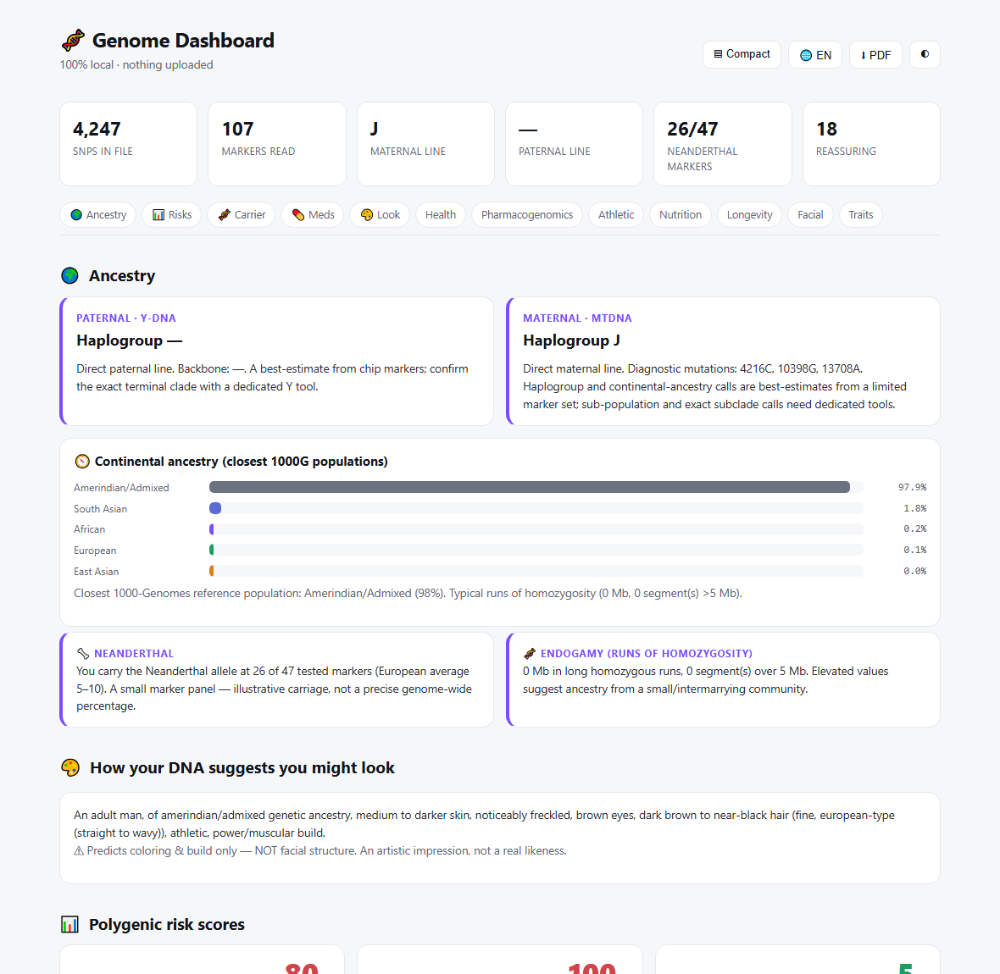
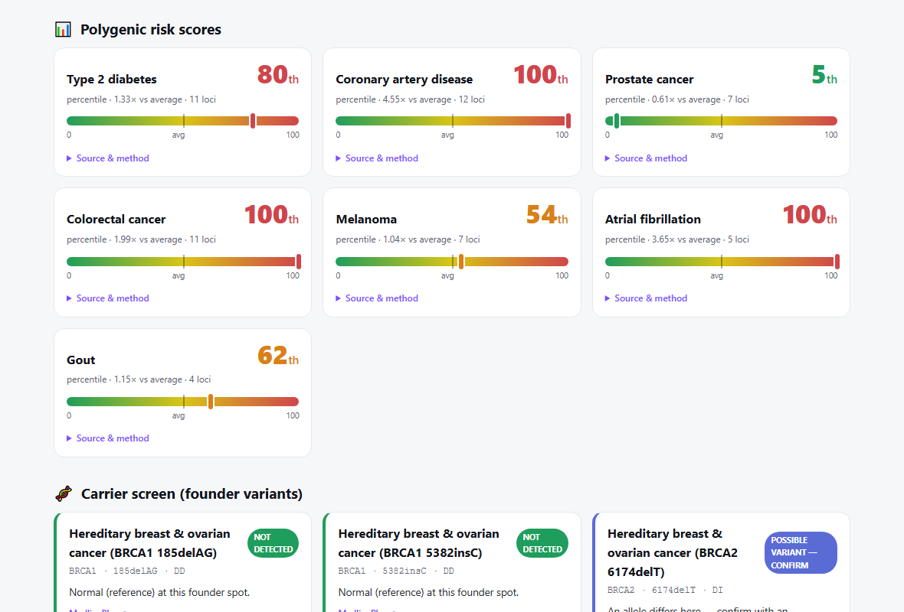
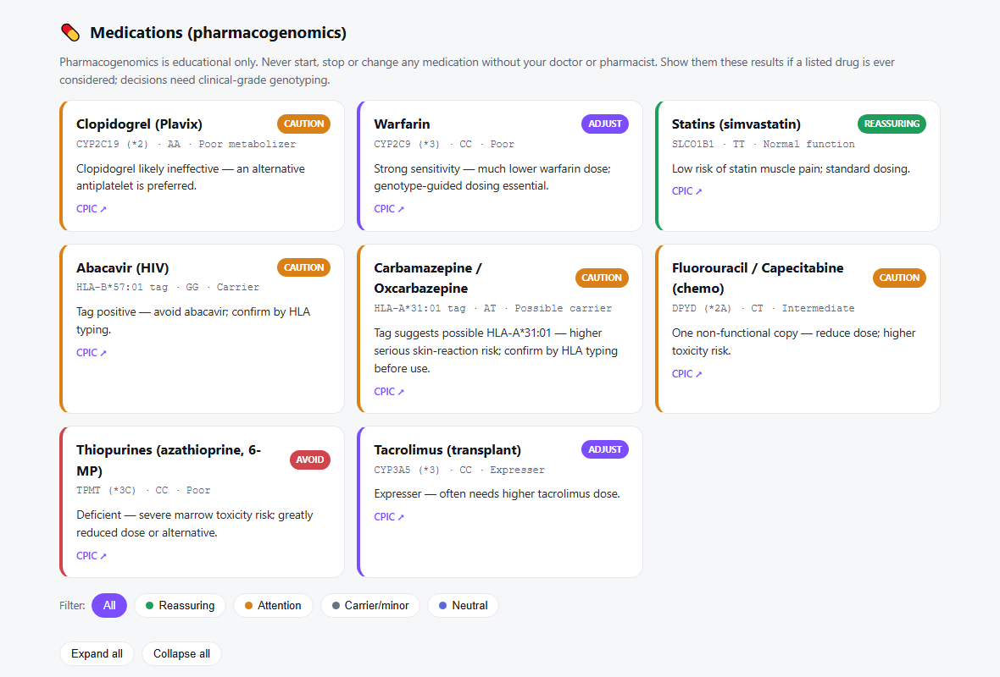
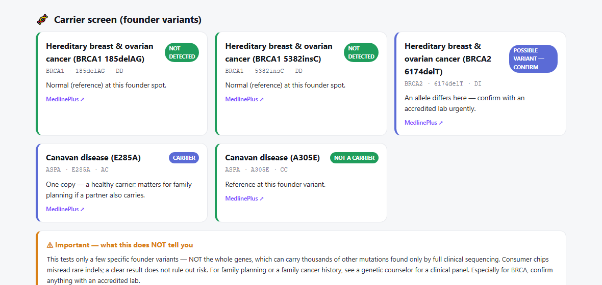
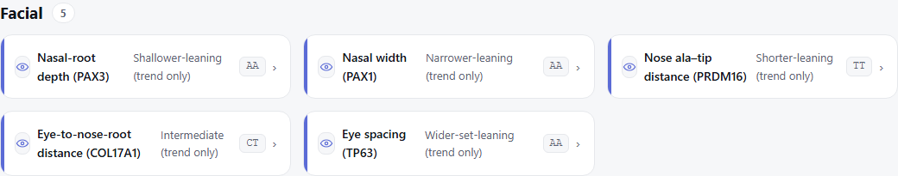
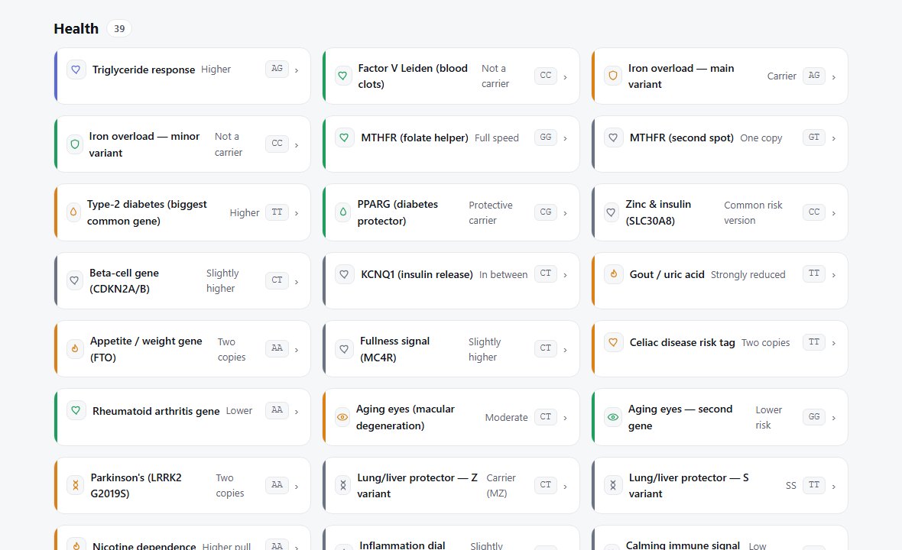

# 🧬 Genome Dashboard (Claude Code Skill)


> # ⚠️ READ THIS FIRST — no warranty, no liability, not medical advice
>
> **This is an educational, curiosity tool. Everything it shows is a *statistical estimate* —
> population-level associations and probabilities pulled from public research databases. It is
> NOT fact, NOT a diagnosis, NOT a prediction about you as an individual.** Consumer DNA chips are
> error-prone, read only a tiny slice of your DNA, and most genetic effects are minuscule and
> heavily outweighed by lifestyle, environment, age, and chance.
>
> **The author and contributors accept NO responsibility and NO liability whatsoever** for any
> decision, action, health outcome, distress, or consequence arising from this software or its
> output. It is provided **"AS IS", without warranty of any kind**. **Do NOT** make any medical,
> health, dietary, lifestyle, reproductive, financial, or other decision based on it. For anything
> that matters — especially cancer risk, carrier status, or drug response — consult a qualified
> clinician, an accredited clinical laboratory, and a genetic counselor. A "clear" result here does
> not rule anything out.
>
> **By using this software you accept these terms and use it entirely at your own risk.**

Turn a personal raw DNA file into a single **offline, self-contained HTML dashboard** —
traits, health, pharmacogenomics, athletic, nutrition, longevity, facial tendencies, ancestry
(Y & mtDNA haplogroups + continental composition + runs of homozygosity), a Neanderthal estimate,
polygenic risk scores, a carrier screen, and an optional DNA-based portrait.



*Above: the bundled `examples/example_dashboard.html`, rendered from 100% synthetic data (not a real person).*

<details open>
<summary><b>More screenshots</b> (all from the synthetic example)</summary>

**Polygenic risk scores** — GWAS-Catalog-weighted, with source & method per trait


**Medications (pharmacogenomics)** — CPIC guidance, colour-coded avoid / caution / adjust / reassuring


**Ancestry carrier screen** — founder variants with a prominent "what this does NOT tell you"


**Facial tendencies** — every card capped as a <1% population trend, never a face reading


**Trait cards** — genotype-keyed, filterable, with per-gene icons


</details>

## Quick start
```
python run.py --input your_raw_dna.txt --out dashboard.html
```
Open `dashboard.html` in any browser. **Fully offline. Your DNA never leaves the machine.**

The report opens with a **sticky jump-nav** (click a section to scroll to it, active section highlights as you scroll), **collapsible trait cards** (one-line summary — icon, result, genotype — click any card to expand the explanation; *Expand / Collapse all* per section), and a **compact / detailed** density toggle (▦) in the header. Filters, language switch, theme, and *Save as PDF* work in every mode. Turn features off with `--no-nav`, `--no-collapse`, `--no-compact`.

- `--input`  23andMe (v3/v4/v5) or AncestryDNA raw file (format auto-detected)
- `--out`    output path (default dashboard.html)
- `--lang ru,es`  add languages (needs `LLM_API_KEY`; a live switch appears in the report)
- `--images`      decorative hero art (needs `IMAGE_API_KEY`; generic prompts only, never your DNA)
- `--portrait N`  N speculative DNA-based portrait variants (needs `IMAGE_API_KEY`)
- `--env path`    a .env file holding optional API keys

No API keys ⇒ English-only, image-free, fully offline (graceful degradation).

## Example output
`examples/example_dashboard.html` is a complete dashboard rendered from `examples/mock_person.txt`
— **fully synthetic, fabricated genotypes, not a real person**. Open it to see what the report
looks like. Regenerate:
`python scripts/make_mock.py && python run.py --input examples/mock_person.txt --out examples/example_dashboard.html`

## How it works / stays generic
`run.py` → `scripts/run_analysis.py` runs the engines over the parsed genotypes + **bundled,
frozen reference data** (`reference/*.json`: SNPedia haplogroup DB, 1000G frequencies, GWAS
Catalog PRS weights, CPIC/carrier catalogs, mtDNA PhyloTree). No personal data is bundled; the
SNP catalog is keyed by genotype so it works for anyone. Refresh reference data with
`python scripts/refresh_reference.py` (opt-in, online).

## Getting more markers (imputation vs sequencing)
A genotyping chip reads a fixed subset of positions. Two ways to expand it:
- **Imputation (free).** TOPMed / Michigan Imputation Server statistically infer tens of millions
  of extra SNPs from your existing file — no new sample needed.
- **Whole-genome sequencing (~$200–600).** Reads all ~3 billion bases: rare variants arrays skip,
  plus things arrays can't resolve — e.g. **CYP2D6 copy number** and **full BRCA / carrier-gene
  sequencing** (not just founder SNPs).

Neither meaningfully improves *facial* prediction — facial structure is hugely polygenic and
environmental, so even a full genome yields only coarse population tendencies, not a face.

## Data sources & licensing
SNPedia · Ensembl/1000 Genomes · GWAS Catalog · CPIC/PharmGKB · MITOMAP/PhyloTree · MedlinePlus.
See `reference/MANIFEST.md`. **Code** is MIT-licensed (see `LICENSE`). **Bundled reference data**
retains its original licenses — notably SNPedia content is **CC-BY-SA-NC** (non-commercial,
share-alike); use accordingly.
